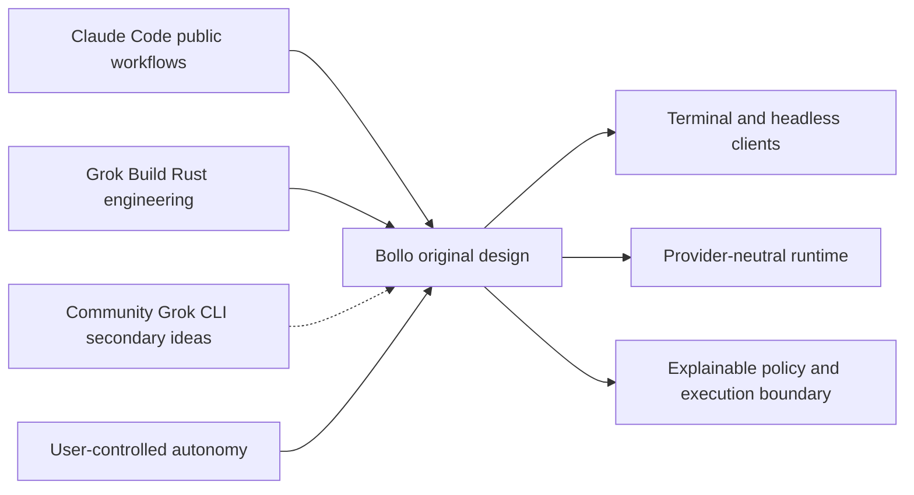
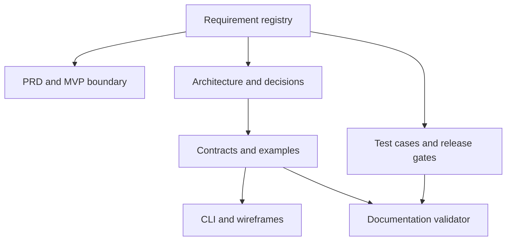

# Bollo Harness — project blueprint

**Design proposal v0.1 | 2026-10-03 | Owner approval pending**

## 1. What is being born

A local-first terminal agent that can understand a repository, plan changes, edit
files, run verification, and explain exactly which permissions made each action
possible. Users choose how much supervision they want. The harness works with
multiple model providers without being owned by any one provider's CLI.

The synthesis is behavioral and architectural, not a claim that two codebases can
be pasted together. Claude Code contributes **publicly documented workflow ideas**:
context → action → verification, project instructions, extensibility, and approvals.
Official Grok Build contributes **inspectable engineering patterns**: a native runtime,
separate tool and workspace boundaries, explicit policy modules, and multiple client
surfaces. Community Grok CLI contributes a second, more approachable implementation
reference for agent orchestration, session storage, and integration ergonomics.
See the [evidence-backed comparison](research/comparison.md).

## 2. The daily experience

1. Open a repository. Bollo identifies its root, pending changes, configuration sources,
   and instruction files without executing project code.
2. Choose a provider/model and a permission preset. A capability check explains whether
   requested sandbox isolation actually works on this machine.
3. Ask for a feature or fix. Bollo plans, gathers bounded context, and streams progress.
4. Tools pass through a single policy gate. An approval shows the command or diff,
   affected scope, matching rule, sandbox state, and budget.
5. Review changed files and test evidence. "Completed" means the run stopped normally;
   verification is separately marked passed, failed, skipped, or inconclusive.
6. Resume later using durable session records. An interrupted shell action is not
   silently replayed: its effects may be unknown.

## 3. The autonomy contract

| Preset | Intended experience | Default mutation behavior |
|---|---|---|
| `read_only` | Explore without changing project content | Deny writes, shell, external side effects |
| `balanced` | Supervised development; initial default | Ask for writes, shell and external side effects |
| `workspace_auto` | Low-friction coding in an enforced workspace sandbox | Permit workspace writes and contained shell; external/MCP side effects still ask |
| `unrestricted` | Owner-selected host autonomy | Permit supported tools unless an explicit deny/ask or managed ceiling applies |

Sandbox selection is separate: `workspace` or `off`. No preset bypasses API auth,
schema validation, an administrator's ceiling, or a provider's own policy. Personal
users may edit their own deny rules and budgets. Unrestricted host execution is a
real risk acceptance, not a security guarantee. Repository text cannot authorize it.
Details and exact precedence: [permissions](security/permissions.md).

## 4. Proposed technical shape

- Rust workspace; Tokio asynchronous runtime; Ratatui-style TUI; JSON Schema contracts.
- One embedded runtime in the MVP. No required daemon, web server, or cloud account.
- Anthropic Messages and xAI Chat Completions adapters initially; one capability model.
- Built-in read/search/write/patch/exec/git inspection tools and MCP stdio tools.
- SQLite journal, redacted artifacts, preimage-backed patch checkpoints.
- Linux-first enforced sandbox release; macOS capability-gated beta; native Windows deferred.
- Later: authenticated local API, Streamable HTTP MCP, ACP client adapter, read-only
  subagents, and controlled parallel worktrees. These are not MVP promises.

These are **recommended decisions**, not a user-approved stack selection. A short
technical spike must validate sandbox feasibility and provider parity before core
implementation. [ADRs](decisions/decision-log.md) record alternatives and reversal costs.

## 5. How the documents stay aligned

The [requirements registry](product/requirements.json) is authoritative for IDs,
phase and acceptance. Schemas own field names; prose owns behavior and rationale.
The [traceability matrix](product/traceability.md) connects each requirement to
components, documentation and an identified acceptance test. No section is evidence
that software already exists.

## 6. Honest boundaries

This is a broad initial design baseline, not "every possible document" or a full
line-by-line audit of upstream. The source inventory enumerates every tracked path
in both Grok snapshots; deep research covers selected critical subsystems. Claude
Code internals and private vendor endpoints are not reconstructed. Open issues,
performance targets, and untested assumptions remain visible instead of being
presented as finished implementation facts.

**Recommended next approval:** accept the primary upstream choice, Rust direction,
Linux-first support, and four permission presets; then commission the Phase 0 spikes.
