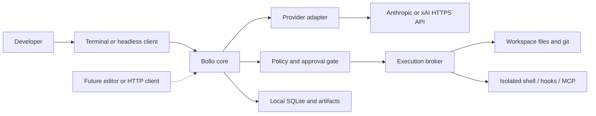
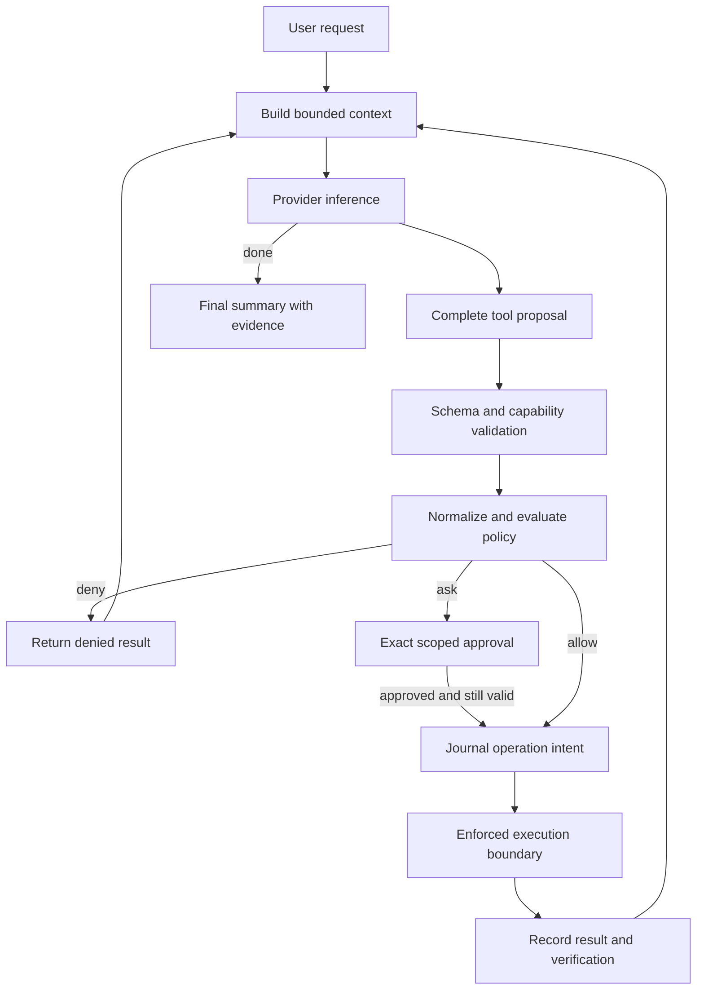
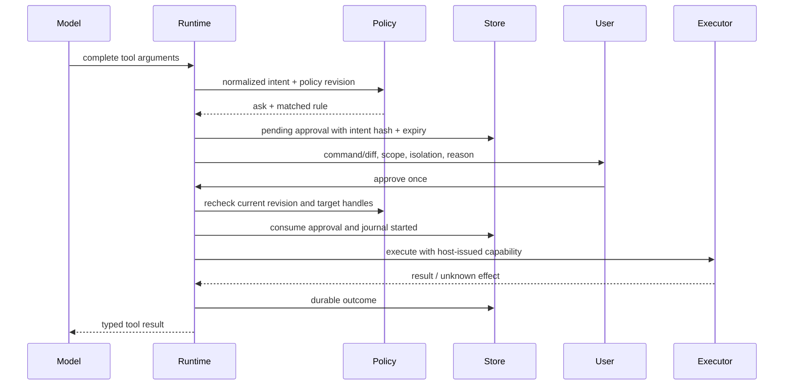
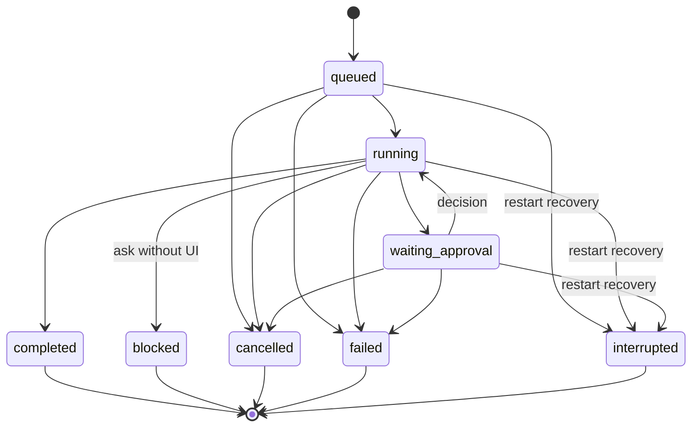
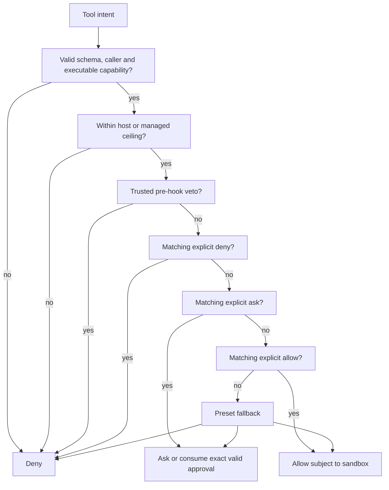
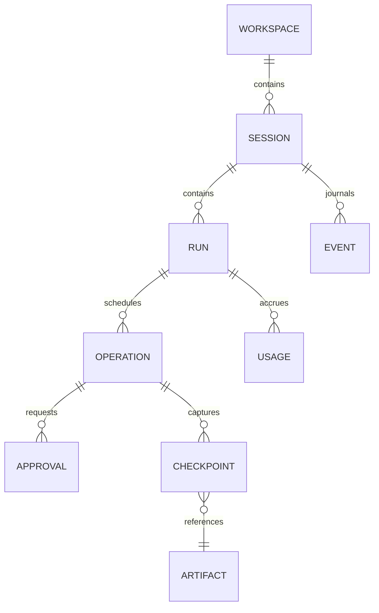
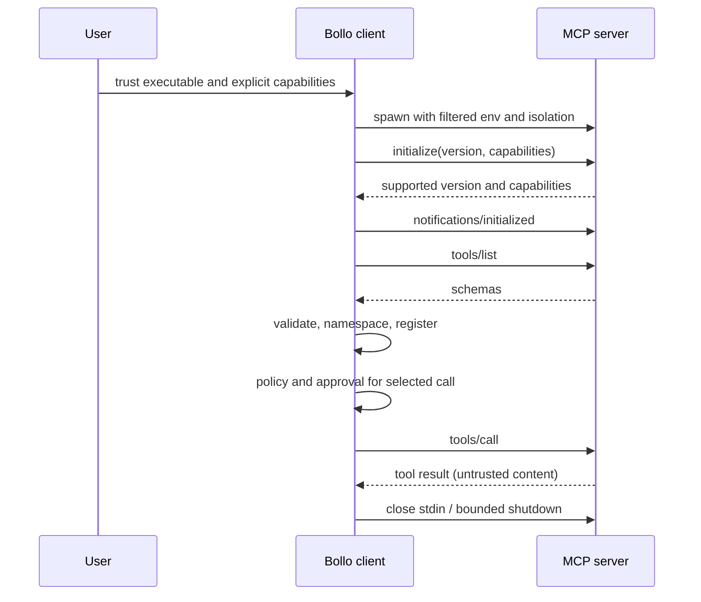
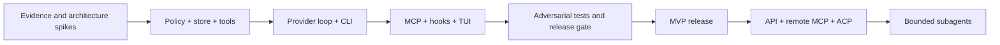

# Mermaid visual architecture

All diagrams are proposed Bollo behavior. Upstream conceptual diagrams live in research.
Render with Mermaid-compatible Markdown; code blocks remain readable without rendering.

## 1. System context

## 2. Agent loop and trust boundaries

## 3. Approval sequence

## 4. Run state machine

## 5. Policy resolution

## 6. Store entities

## 7. MCP lifecycle

## 8. Release dependencies

