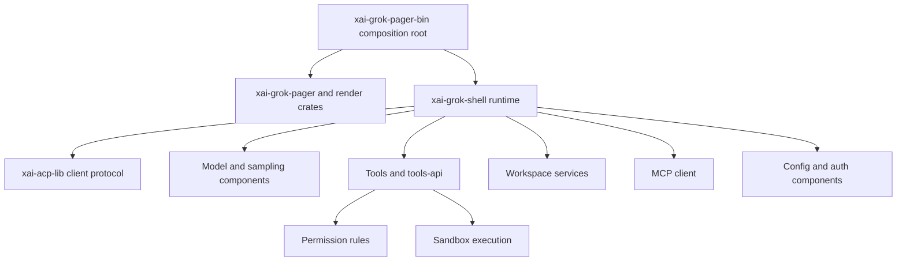

# Official Grok Build — engineering dissection

Pinned commit `2bdd1d6a6369de0e8c68132ea4539e9abd9e14a8`. SOURCE/DOC evidence is linked below. This is a subsystem map,
not an assertion that every internal call path was traced or that the tree was built.

## Composition and execution map

This diagram is a **conceptual component grouping**, not a generated Cargo dependency
graph. The [README](https://github.com/xai-org/grok-build/blob/2bdd1d6a6369de0e8c68132ea4539e9abd9e14a8/README.md), [runtime exports](https://github.com/xai-org/grok-build/blob/2bdd1d6a6369de0e8c68132ea4539e9abd9e14a8/crates/codegen/xai-grok-shell/src/lib.rs)
and crate tree support the boundaries; individual runtime call paths need tracing.

## Source navigation and responsibilities

| Path (under `crates/codegen/`) | Inspection finding | Bollo implication |
|---|---|---|
| `xai-grok-pager-bin` | Documented composition root and binary artifact | Keep setup out of policy library |
| `xai-grok-pager`, `xai-grok-pager-render` | UI and rendering split in tree | UI consumes events, never executes tools directly |
| `xai-grok-shell/src/lib.rs` | Exports agent, session, leader, sampling, tools, inspect and remote modules | Separate core lifecycle from clients |
| `xai-grok-tools-api/src/lib.rs` | Generated protobuf API and shared validation; tool state/config types | Version tool contracts independently of implementations |
| `xai-grok-tools-api/proto/grok-tools.proto` | Unary and streaming execution plus configuration RPCs | Distinguish internal RPCs from public hosted APIs |
| `xai-grok-permission-rules/src/lib.rs` | Pure-looking boundary without importing agent/tool/session in module comment | Build testable policy evaluator |
| `xai-grok-permission-rules/src/managed_policy/` | Layer/parse/verdict/url-match modules enumerated | Model administrative ceilings explicitly, later phase |
| `xai-grok-sandbox/src/command/` | Backend detection, canonicalization, grants/protected-path modules | Capability probe and race-safe execution gate |
| `xai-grok-workspace/src/file_system/` | Local, ACP and client adapters plus content/git status modules | Centralize filesystem effects |
| `xai-grok-config/src/` | Layering, overrides, effective config and atomic writes | Inspectable config provenance |
| `xai-grok-mcp/src/` | HTTP, OAuth, credentials, names and liveness modules | Remote MCP is more than passing a URL |
| `xai-acp-lib/src/` | Message, channel, line-reader and normalization modules | Treat framing/versioning as a contract |

Source-path existence is captured by [the full inventory](grok-build-file-inventory.csv).
The research inspected selected module roots and shipped guides, not each listed module's contents.

## Important behavioral findings

1. The custom-model guide documents `chat_completions`, `responses`, and `messages`
   backends. That is a harness-level protocol distinction, not a single interchangeable
   message format. Bollo preserves a normalized layer but isolates provider blocks.
2. The permissions guide documents hooks, deny/ask/allow rules, remembered grants,
   built-in auto-approvals and prompt policy. Always-approve has special short-circuit
   behavior. Bollo intentionally simplifies this: explicit ask remains ask in all presets.
3. The sandbox guide documents default-off behavior and uneven network enforcement
   across Linux/macOS. Bollo requires a demonstrated capability matrix before enabling
   workspace-auto. File policy checks alone cannot contain arbitrary subprocesses.
4. The ACP guide distinguishes stdio, WebSocket serving, relay and headless modes.
   These are not ordinary REST resources. Bollo drafts its own optional HTTP facade
   separately and does not call it ACP.
5. Tools API source reexports protobuf request/response types; a source-defined RPC
   is not a promise that an unauthenticated public endpoint exists for customers.

References: [models](https://github.com/xai-org/grok-build/blob/2bdd1d6a6369de0e8c68132ea4539e9abd9e14a8/crates/codegen/xai-grok-pager/docs/user-guide/11-custom-models.md),
[permissions](https://github.com/xai-org/grok-build/blob/2bdd1d6a6369de0e8c68132ea4539e9abd9e14a8/crates/codegen/xai-grok-pager/docs/user-guide/22-permissions-and-safety.md),
[sandbox](https://github.com/xai-org/grok-build/blob/2bdd1d6a6369de0e8c68132ea4539e9abd9e14a8/crates/codegen/xai-grok-pager/docs/user-guide/18-sandbox.md),
[ACP](https://github.com/xai-org/grok-build/blob/2bdd1d6a6369de0e8c68132ea4539e9abd9e14a8/crates/codegen/xai-grok-pager/docs/user-guide/15-agent-mode.md),
[tools API](https://github.com/xai-org/grok-build/blob/2bdd1d6a6369de0e8c68132ea4539e9abd9e14a8/crates/codegen/xai-grok-tools-api/src/lib.rs).

## Build and reuse implications

The README requires the pinned Rust toolchain, DotSlash and protoc resolution;
macOS/Linux are supported build hosts and Windows builds from the tree are best-effort.
Full workspace checks are described as slow; target selected crates. No timing claim
was measured here. Bollo should not import this build closure before a dependency,
license, platform and telemetry review. Third-party source ports retain their notices.

## Next investigation checklist

Trace one prompt from composition root to streaming output; trace one file patch
through policy and workspace; inspect shell process-group cancellation; inspect
provider error normalization; test sandbox capability failure; run selected crate
tests; compare documented permissions to implementation. Each is unperformed, not
an implied research result.
